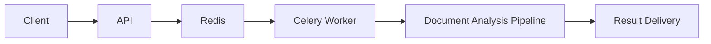
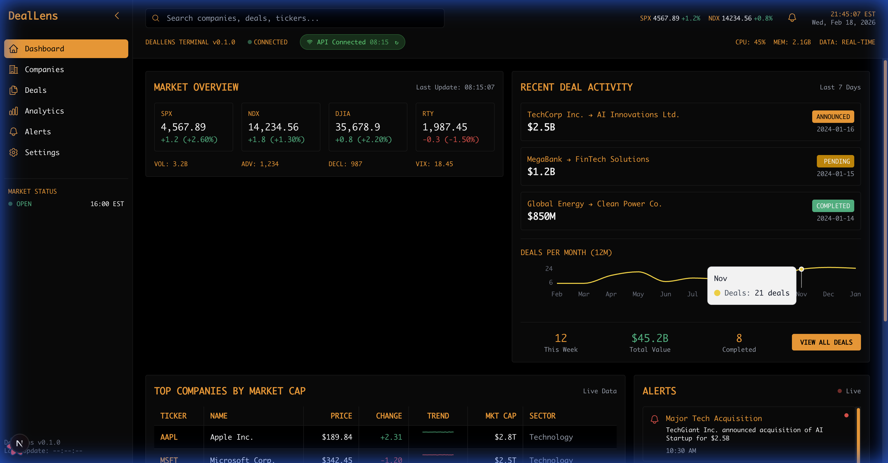
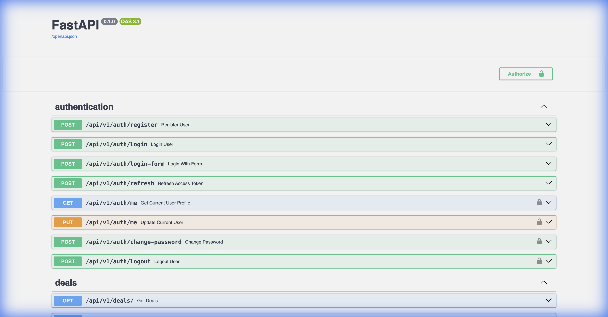
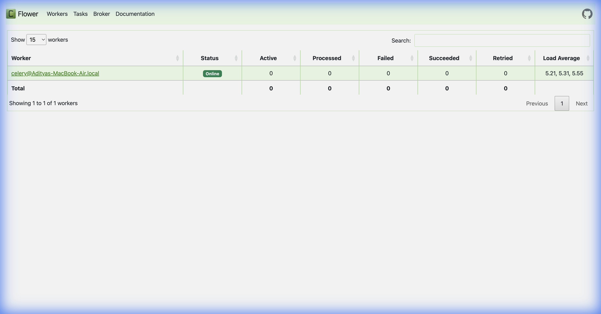

# DealLens AI M&A Screener

A production-style async document analysis backend platform
built to support long-running analyst workflows in M&A screening pipelines.

## 1. Runtime Service Overview

M&A Screening Platform
Async Document Analysis Runtime
FastAPI + Celery Worker Execution Model

## 2. Analyst Screening Interface

This interface demonstrates the async ingestion of screening requests. The analyst uploads deal documents which are processed non-blockingly. The UI updates in real-time as analysis completes, support a high-throughput analyst workflow where multiple deals can be screened in parallel.

## 3. Backend API Surface

The capabilities include:
- **Screening Job Submission**: Secure endpoints for uploading financial documents.
- **Async Analysis Endpoints**: Polling or websocket-based status checks for long-running jobs.
- **Health/Readiness Probes**: Kubernetes-standard `/healthz` and `/readyz` endpoints for liveness and readiness checks.
- **Deployability Checks**: Integration with container orchestration checks.

## 4. Background Worker Runtime

The core of the system is the Celery execution model:
- **Async Execution**: Decouples heavy document processing from the API response cycle.
- **Long-running Tasks**: Handles PDF parsing, financial extraction, and LLM reasoning without timing out HTTP requests.
- **Retryable Execution**: Tasks are designed to be idempotent and retryable in case of transient failures (e.g., LLM rate limits).
- **Worker Isolation**: Processing logic is isolated from the request path, ensuring API responsiveness.

## 5. Runtime Logging + Observability

The system is instrumented for production visibility:
- **Structured Logging**: JSON-formatted logs for ingestion by Splunk/Datadog.
- **Async Execution Visibility**: Trace IDs follow the request from API to Worker.
- **Failure Traceability**: Detailed stack traces and error contexts for debugging production issues.

## 6. Health Monitoring

Standardized health checks ensure:
- **Service Readiness**: Verifies DB and Redis connections before accepting traffic.
- **Runtime Liveness**: Detects deadlocks or frozen processes.
- **System Deployability**: automated rollout gates in CI/CD pipelines.

## 7. Async Screening-Oriented Runtime Design

This system supports:
- **Long-running document analysis**: Optimized for multi-minute processing times.
- **Async analyst workflows**: Fire-and-forget submission with eventual consistency.
- **Service-to-service screening tasks**: API design suitable for programmatic integrations.
- **Ingestion decoupled from processing**: Robust queuing handles traffic spikes without degradation.
- **Background execution paths**: Dedicated compute resources for AI pipelines.

## 8. Integration Use Case

**Enterprise Deal Screening Pipelines**

Example flow:
Deal Upload -> Async Screening -> Risk Evaluation -> Analyst Dashboard

Key use cases:
- M&A pre-screening
- Due diligence automation
- Deal pipeline filtering
- Financial document analysis
